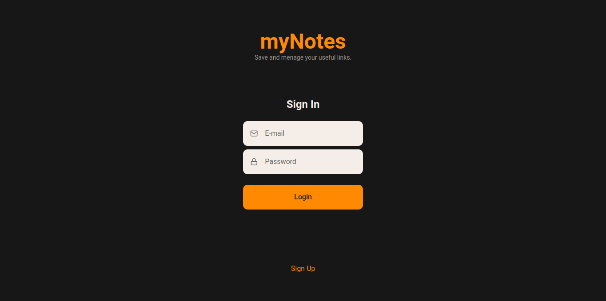
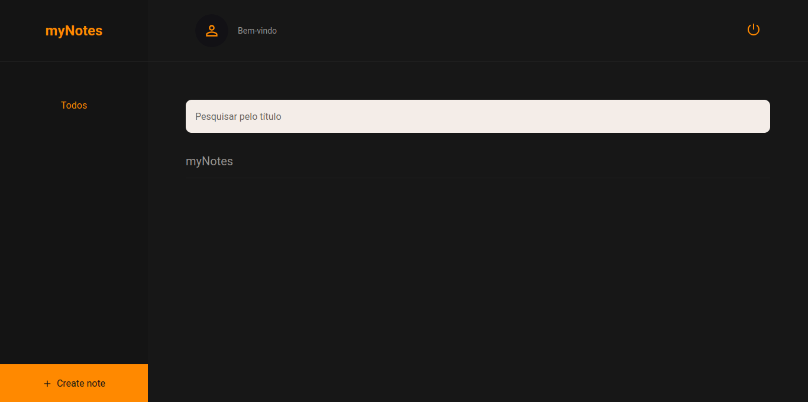

<p align="center">
  <h1 align="center"><a href="https://food-explorer-vasc-333.netlify.app/">myNotes 📱</a></h1>
</p>

> Status: Developed ✅

### Login page:

### Home page:


## About the project 📝

myNotes is a project created with the aim of putting my studies on ReactJS with NodeJS into practice. It's an individual notebook that can only be accessed via an account. With it you can create notes and edit them, as well as categorize them with tags that match the subject. Features:
- Login and registration page
- Home page showing all the notes created by the user
- Field for creating notes
- User profile field
- Possibility of changing user image, name, password and email address.

## Technologies used in this project 🛠️

- [HTML](https://developer.mozilla.org/pt-BR/docs/Web/HTML)
- [CSS](https://developer.mozilla.org/pt-BR/docs/Web/CSS)
- [ReactJS](https://legacy.reactjs.org/docs/getting-started.html)
- [NodeJS](https://nodejs.org/docs/latest/api/)
- [JWT](https://jwt.io/introduction)
- [SQLite](https://www.sqlite.org/docs.html)

## How can I use it? 💻

### 1. Clone the project to your computer.

```bash
$ git clone git@github.com:holices/food-explorer
```

<br>

### 2. With the project open in an IDE, navigate to the API directory and run the commands:

```bash
# Install the packages needed to run the project
$ npm install
```

```bash
# Run the database
$ npm run dev
```

<br>

### 3. Now go back to the root directory and access the MYNOTES folder and run it:

```bash
# Install the packages needed to run the project
$ npm install
```

```bash
# Run the frontend
$ npm run dev
```

<br>

### 4. Now register on the login screen and you're ready to go! 🎉

<br>

## Thank you in advance for any contribution!
